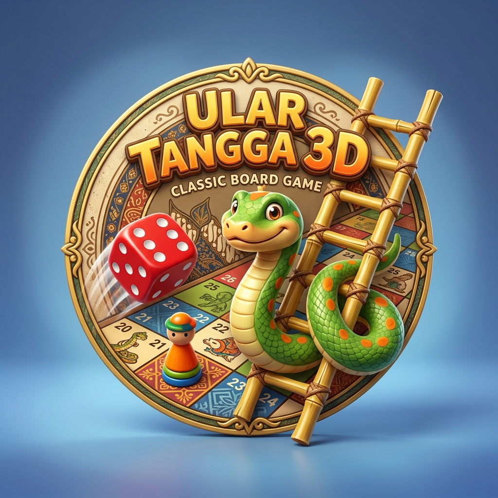

# Ular Tangga 3D Nusantara — Design & Skill Orchestration Document (BLUEPRINT)

## 1. Ringkasan Pemahaman (Understanding Summary)
- **Tujuan Utama**: Game 3D interaktif berbasis web yang mereinkarnasi papan permainan legendaris "Ular Tangga" Indonesia ke dalam grafis 3D penuh warna, interaktif, dan mulus.
- **Model 3D 100% Prosedural**: Tanpa model file eksternal (.gltf/.obj). Semua elemen visual digenerate via Three.js primitives & dynamic canvas texture generator:
  - Papan catur 10x10 dengan zigzag boustrophedon bernomor 1-100 dan corak ornamen klasik.
  - Ular 3D meliuk dinamis (`CatmullRomCurve3` + `TubeGeometry`) lengkap dengan kepala kubah/taring dan mata 3D.
  - Tangga bambu 3D (`CylinderGeometry` untuk tiang dan anak tangga berkait).
  - Dadu 3D dengan chamfer dan bulatan angka (pips) 1 sampai 6.
  - Pion bidak kayu/piala warna-warni 3D (Merah, Biru, Hijau, Kuning).
- **Mekanik Gameplay**:
  - Pilihan jumlah pemain: 1 Player vs Smart AI Bot, atau 2-4 Pemain Lokal Pass-and-Play.
  - Lempar dadu dengan animasi rotasi fisik 3D.
  - Animasi pergerakan pion melompat (*step-by-step hop*) per petak.
  - Deteksi tangga: Pion menaiki tangga ke petak tujuan dengan kamera zoom-in.
  - Deteksi ular: Pion meluncur turun ke petak ekor ular dengan animasi ekspresif.
  - Aturan Kotak 100 Pantul: Pemain harus berhenti pas di angka 100. Bila lemparan dadu berlebih, pion akan memantul mundur.
  - Efek Web Audio API synthesized sound (suara kocokan dadu, langkah pion, perosotan ular, panjat tangga, & trompet kemenangan).

## 2. Arsitektur Teknis & Delegasi Skill
| Komponen | Spesifikasi Teknis | Skill yang Diorkestrasikan |
|---|---|---|
| **3D Rendering & Geometry** | Three.js (r128+), WebGLRenderer, PCFSoftShadowMap, Ambient & Directional Light, OrbitControls | `web-3d-graphics-expert`, `glsl-shader-expert` |
| **Game State Machine & Loop** | 60 FPS RequestAnimationFrame, Tile coordinate lookup matrix, Step interpolator | `web-game-engine-expert` |
| **Procedural Audio Engine** | Web Audio API (OscillatorNode, GainNode, AudioContext noise generator) | `audio-synthesis` / `web-game-engine-expert` |
| **UI/UX & Overlay HUD** | Modern Vanilla CSS, Glassmorphism, Responsive HUD, Turn Indicator, Scoreboard | `ui-ux-pro-max`, `modern-css-native-expert`, `hig` |
| **Animation & Camera Flow** | TWEEN / Smooth easing interpolation, Multi-camera mode (Orbit & Dynamic Action Cam) | `svg-animation-motion-expert` |
| **Quality & Zero-Error Hardening**| Responsive viewport handling, touch/mouse multi-device compatibility, edge case validation | `production-ready-hardener`, `e2e-testing-expert` |

## 3. Komponen & Arsitektur UI
1. **Header / Navbar**:
   - Logo game resmi `assets/logo.jpg`.
   - Judul game "Ular Tangga 3D Nusantara".
   - Tombol kontrol: Pengaturan Musik/SFX toggle, Kamera View Reset, dan Bantuan Panduan Bermain.
2. **Main 3D Canvas Area**:
   - Menempati layar penuh dengan interaksi sentuh / mouse drag untuk rotasi papan.
   - Papan 3D dengan pencahayaan hangat studio dan bayangan nyata di bawah bidak, tangga, dan ular.
3. **Turn & Action Glass Panel**:
   - Avatar & nama pemain yang sedang mendapat giliran (highlight neon dinamis).
   - Tombol "Kocok Dadu" interaktif dengan efek hover 3D.
   - Hasil angka dadu terakhir & status pergerakan (misal: "Mendapat angka 5! Melangkah...").
4. **Leaderboard & Player Tracker**:
   - Posisi masing-masing pemain (1-100) dengan indikator visual progress bar.
5. **Winner Modal / Celebration Overlay**:
   - Efek konfeti partikel 3D berkilauan menyembur di atas papan.
   - Pengumuman juara dan tombol "Main Lagi".

## 4. Log Keputusan (Decision Log)
| # | Keputusan | Alternatif Dipertimbangkan | Rasional & Prinsip Web Modern | Skill yang Diorkestrasikan |
|---|---|---|---|---|
| 1 | Model 3D 100% Prosedural | Download file `.gltf` / `.obj` eksternal | Menghilangkan risiko gagal load aset, 0 latency download, instan jalan di semua perangkat | `web-3d-graphics-expert` |
| 2 | Pure WebGL Three.js Standalone | Framework berat (React/Next/Babylon) | Game papan 3D mandiri paling efisien dan cepat tanpa dependensi berat, loading < 1s | `senior-frontend`, `performance-web-vitals` |
| 3 | Web Audio API Synthesizer | File audio .mp3 eksternal | Tidak ada aset audio eksternal yang hilang, audio sintetis retro yang dinamis dan ringan | `web-game-engine-expert` |
| 4 | Aturan Pantul Kotak 100 | Langsung menang saat >= 100 | Menjaga esensi dan tensi nostalgia permainan ular tangga asli Indonesia | `web-game-engine-expert` |

## 5. Penilaian Risiko & Mitigasi
- **Kinerja Mobile Rendah**: Shadow map resolution disesuaikan dinamis, geometri tube ular dioptimalkan dengan segmentasi seimbang (radialSegments: 8, tubularSegments: 32).
- **Tabrakan Bidak di Petak yang Sama**: Algoritma offset posisi otomatis jika lebih dari 1 bidak berada di petak nomor yang sama agar tidak saling bertumpuk aneh.
- **Kamera Pusing**: Transisi kamera dibuat dengan kurva peredam halus (*cubic ease-out*) dan pemain selalu bisa beralih ke kamera manual kapan saja.
