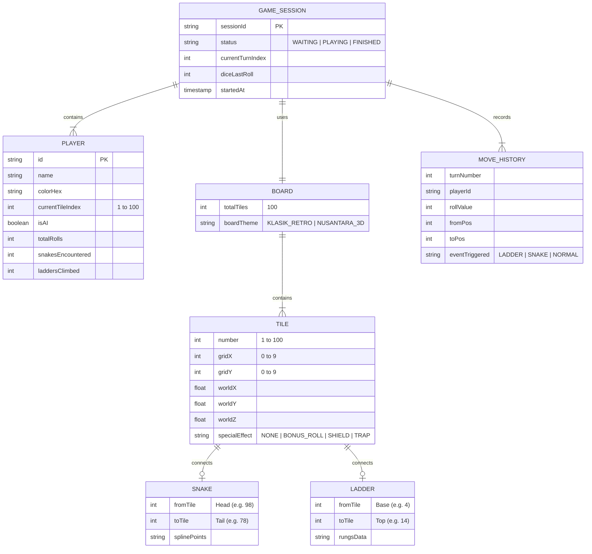

# Entity Relationship & State Architecture (ERD)
**Project**: Ular Tangga 3D Nusantara

```mermaid
erDiagram
    GAME_SESSION ||--|{ PLAYER : contains
    GAME_SESSION ||--|| BOARD : uses
    BOARD ||--|{ TILE : contains
    TILE ||--o| SNAKE : connects
    TILE ||--o| LADDER : connects
    GAME_SESSION ||--|{ MOVE_HISTORY : records

    GAME_SESSION {
        string sessionId PK
        string status "WAITING | PLAYING | FINISHED"
        int currentTurnIndex
        int diceLastRoll
        timestamp startedAt
    }

    PLAYER {
        string id PK
        string name
        string colorHex
        int currentTileIndex "1 to 100"
        boolean isAI
        int totalRolls
        int snakesEncountered
        int laddersClimbed
    }

    BOARD {
        int totalTiles "100"
        string boardTheme "KLASIK_RETRO | NUSANTARA_3D"
    }

    TILE {
        int number "1 to 100"
        int gridX "0 to 9"
        int gridY "0 to 9"
        float worldX
        float worldY
        float worldZ
        string specialEffect "NONE | BONUS_ROLL | SHIELD | TRAP"
    }

    SNAKE {
        int fromTile "Head (e.g. 98)"
        int toTile "Tail (e.g. 78)"
        string splinePoints
    }

    LADDER {
        int fromTile "Base (e.g. 4)"
        int toTile "Top (e.g. 14)"
        string rungsData
    }

    MOVE_HISTORY {
        int turnNumber
        string playerId
        int rollValue
        int fromPos
        int toPos
        string eventTriggered "LADDER | SNAKE | NORMAL"
    }
```
